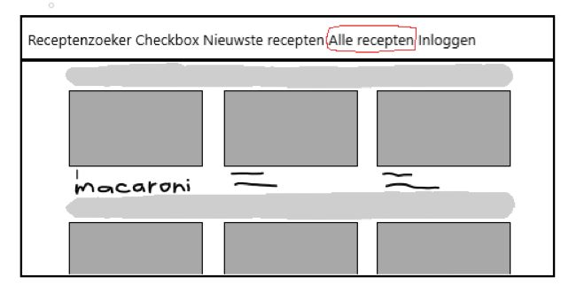
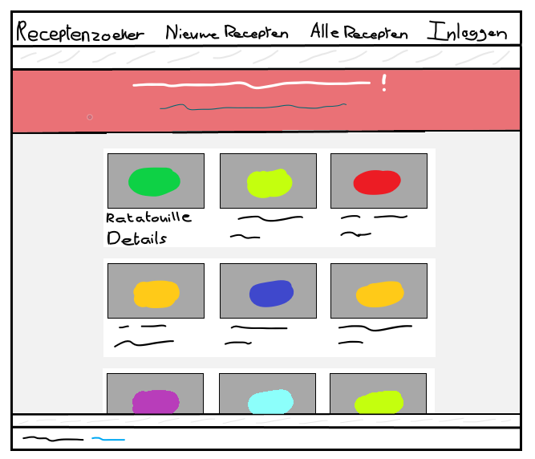
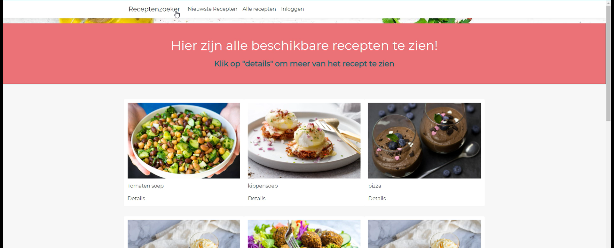
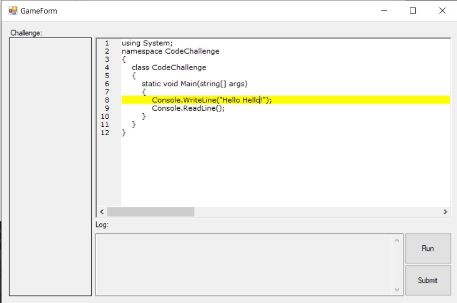
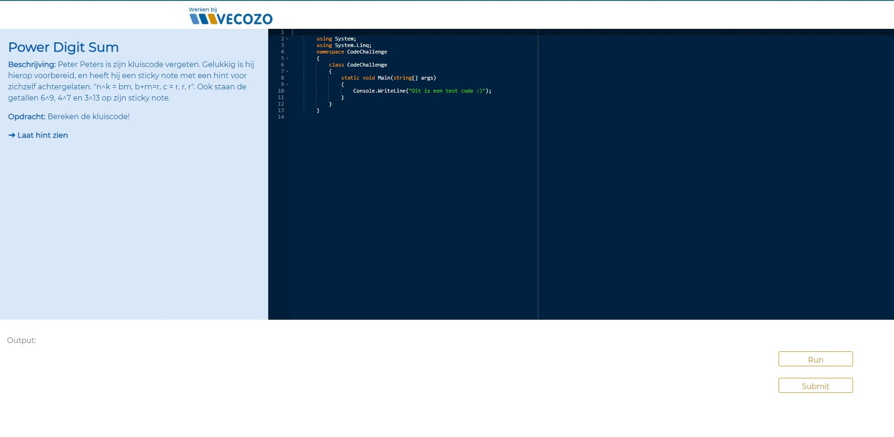

# School projects that I made or collaborated on during my studies
In this repository, you'll learn about me, my projects and my work ethics.

## About me:
Hi my name is fabiënne Leidekker. I'm currently studying ICT & Software at Fontys university in Eindhoven. Besides software I've been specialising in the field of mobile development and design. I consider myself a full-stack developer, where the software is as important as the design and experience. In my free time I like to do:
- Gaming🎮
- Playing music (I can play guitar, keyboard and bass🎸🎹🎵)
- Hanging with friends (with an occasional beer off course🍺😉)
- D&D🐲
- Chilling in parks🌳🌺
- Snowboading🏂

I'm born and raised in the Netherlands, so Dutch is my first language, but I also speak English fluently and have a basic knowledge of German. I'm very dedicated and serious about the things a make, but I do know how to find a balance in being professional and having fun. I work hard to keep improving my skills. I can also work well in a group, but working individually is also not a problem.

As an ICT & Software student, I've had the opportunity to work with multiple programming languages, such as C#, Java, Javascript (React), Swift and Kotlin (Jetpack Compose) (and HTML and CSS, but they are considered mark-up and styling languages). But I'm very adaptable to learning a new language!

## My work ethics step-by-step:
### Planning - agile (scrum)
Even when working alone, I work with an agile (scrum) flow. Planning per sprint what features and task I need to implement. I have experience in both Azure DevOps and JIRA.   

### Sketching - Improving - Implementation
When I want to build something on the front-end, I start of by making very simple sketches on figma or paint. Then I make a second version that gives me a more concrete visual. If I like to look of it, I start implementing it on the front-end.   

   

### Building
I've worked with a couple different tech stacks, such as ASP.NET in combination with Microsoft SQL server and Java Springboot with MySQL and React.
Some project I've worked on: 
- S1: (group) A simple platformer (Unity)
- S2: (individual) A recipe finder web app (ASP.net)
- S2: (group) A vecozo code compiler web app (ASP.net)
- S3: (individual) A find musicians web app (Springboot)
- S3: (group) A Sioux parking management system (Springboot)
- S4: (duo) A mobile boardgame recommendations app (PWA)
- S4: (duo) A mobile find housing app (Android/ Jetpack Compose)
- S4: (duo) A simple mobile health tracker (IOS/ Swift)
